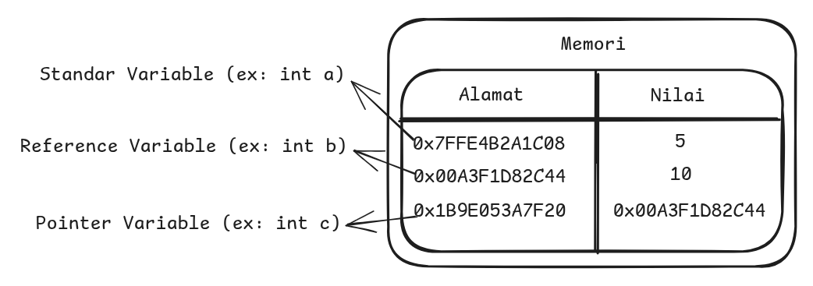

Saat kita mulai belajar bahasa pemrograman C pada waktunya kita akan mulai bertemu dengan konsep pointer, dan mungkin memang sudah inilah waktunya

Okay, jadi kali ini saya akan coba sharing tentang pointer, baik apa itu pointer, konsep dasar dan penggunaanya. Nahh, kita mulai dulu dari

## Konsep Dasar Pointer

Sebelum ke definisi apa itu pointer, kita perlu melihat dahulu konsep dasar pointer itu seperti apa, agar kita bisa membayangkan dibalik layarnya seperti apa. Dibawah saya lampirkan contoh visualisasi sederhana dari bagaimana sebenarnya variabel kita tersimpan di memory


Dari contoh gambar diatas, kita bisa lihat masing masing variable diatas yaitu variable a, b dan c memiliki alamat dan nilai. `Alamat`, itu adalah lokasi dari variable kita di memory sedangkan `nilai` adalah value (nilai) dari variable yang kita buat

Kita bisa lihat di contoh diatas variable c memiliki nilai yaitu alamat dari variable b, sehingga bisa kita sebut `variable c adalah sebuah pointer`

Sedangkan alamat dari variable b digunakan sebagai nilai dari variable c, sehingga bisa kita sebut `variable b adalah sebuah reference`

Nah karena hal diatas, kita melihat variable c dan b memiliki hubungan pointer dan reference. Jadi jika saya mengubah nilai variable c menjadi angka 20, maka nilai dari variable b akan ikut berubah menjadi 20. Sehingga bisa kita anggap mereka memiliki sebuah kontrak atau janji yang berbunyi seperti ini

> _Jika nilai dari variable reference berubah maka nilai dari variable pointer ikut berubah, begitupun sebaliknya jika nilai dari variable pointer berubah maka nilai dari variable reference ikut berubah_

## Apa itu Pointer

Nahh berdasarkan konsep yang kita bahas diatas, jika ditanya apa itu pointer? maka jawaban saya:

> _Pointer adalah sebuah variable yang menyimpan alamat memori dari variable lain sebagai nilai_

## Contoh Penggunaanya

Sekarang mari kita praktik contoh penggunaanya di bahasa pemrograman C. Untuk pembuatan variable pointer kita harus menggunakan simbol `*`, sedangkan untuk reference kita menggunakan simbol `&`. Berikut dibawah contoh kode sederhana penerapan pointer.

```C
#include <stdio.h>

int main()
{
    int a = 5; // Reference
    int *b = &a; // Pointer

    printf("%d\n", a);
    printf("%d", b);

    return 0;
}
```
